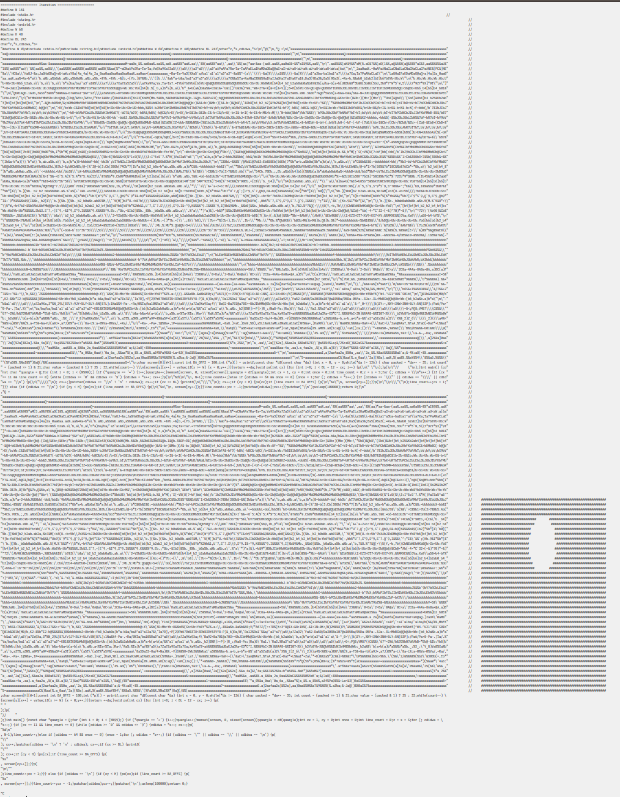

<b>Left: the program. Right: Bad Apple frame in the comments</b>

# Quine Apple: Bad Apple in a C Quine (devpost with minor modifications)

## Inspiration
Doom on \<X\> is a popular hobby for a certain demographic. Recently, I'd seen [Doom on a pregnancy test](https://www.popularmechanics.com/science/a33957256/this-programmer-figured-out-how-to-play-doom-on-a-pregnancy-test/). [Bad Apple](https://www.youtube.com/watch?v=FtutLA63Cp8) is a popular internet video which has been run on at least [149 things according to this playlist](https://www.youtube.com/watch?v=cuMkI6cDKMs&list=PLajlU5EKJVdonUGTEc7B-0YqElDlz9Sf9), including [Desmos](https://youtu.be/MVrNn5TuMkY?list=PLajlU5EKJVdonUGTEc7B-0YqElDlz9Sf9), [HTML Checkboxes](https://youtu.be/ZGvXdYXami4?list=PLajlU5EKJVdonUGTEc7B-0YqElDlz9Sf9), and a [TI-84](https://youtu.be/6pAeWf3NPNU?list=PLajlU5EKJVdonUGTEc7B-0YqElDlz9Sf9). Following in this illustrious tradition, I present Bad Apple in a quine.

## What
A [_quine_](https://en.wikipedia.org/wiki/Quine_(computing)) is a program that takes no input and produces itself as output. A "simple" (I wouldn't call it that!) C quine is the following ([from StackOverflow](https://stackoverflow.com/questions/60212717/quine-program-example-in-c)):
```c
char*f="char*f=%c%s%c;main(){printf(f,34,f,34,10);}%c";

main() {
    printf(f,34,f,34,10);
}
```

I present a quine written in C which when compiled and executed, produces output which contains a Bad Apple frame in comments along with its own source code. This output can be saved into a C file, compiled and executed to print the _next_ Bad Apple frame in comments along with its source code. This can be repeated in an infinite loop to play the first 100 frames* from Bad Apple in a loop.

*: We actually sample one out of every two frames to have more variety, so it's really every other frame from the first 200 frames.

## How
A good starting point was [this repository of quines](https://github.com/Wonshtrum/quines) which contains good examples of writing C quines. I tried to copy as little as possible, and while the method of making a quine is directly taken from this repository, many of the surrounding scripts used for generating data and formatting the quine were written independently.

## Why
Made in <24 hours for Purdue University's Catapult hackathon.

## Other ideas that were considered but did not make it
My original idea for this project was to somehow derive Bad Apple from visualizing a compiler's optimization passes on a seemingly-innocuous program. I thought of a scheme on coloring cells based on whether an IR node was optimized in a pass or not, but realized that the code that would trigger this would look rather boring or be very hard to construct.
I then considered coming up with more interesting looking expressions that could still lead to Bad Apple in optimization passes. I considered deriving implicit surface formulas for each frame (which I knew from [Matt Keeter's research](https://www.mattkeeter.com/projects/prospero/)) but that proved to be more complicated than doable in the few hours I had (and embedding a bytecode machine to render implicit surfaces is a compiler felt contrived). I then switched to thinking about quines and landed on the current idea.

## What's next for Quine Apple: Bad Apple in a C Quine
I might attempt to figure out better compression, grayscale rendering, and a smaller ("golfed") quine.

# Project Structure
- [`quine.c`] - The main template source file
- [`quine.pack.c`] - Generated packed version of the quine, emitted by `generate_quine.hs`.
- [`generate_quine.hs`] - Haskell script to generate and format the packed quine. `hMini` is WIP next-generation for this.
- [`quine.sh`] - Shell script to repeatedly compile, execute, display and compile the output again.
- [`bad_apple_processing/`]
  - [`bad_apple.gif`](bad_apple_processing/bad_apple.gif) - The Bad Apple animation
  - [`bitmap.py`](bad_apple_processing/bitmap.py) - Python script to process video frames and output a compressed C representation

## Running

```bash
./quine.sh # compiles and runs the quine in a self-feeding loop.
```

# Fun notes that I'm not currently proud of

- Fun note 1: the current Haskell script is bad at stripping comments, so any comments that do not start with `\t*\/\/` are not deleted and *will* corrupt other code when newlines get folded and cause a compilation failure.
- Fun note 2: the Haskell script struggles with properly folding escaped strings so you may to search for a particular width that will allow the compressed quine to compile. The quine, at runtime, must also perform width compression and therefore has a width parameter as well which should be exactly 1 more than the Haskell script parameter. Additionally, the code I've worked on was already badly documented when I touched it and has only gotten worse, and so the reason that the first line's comments are offset compared to the rest of the comments is a mystery to me.